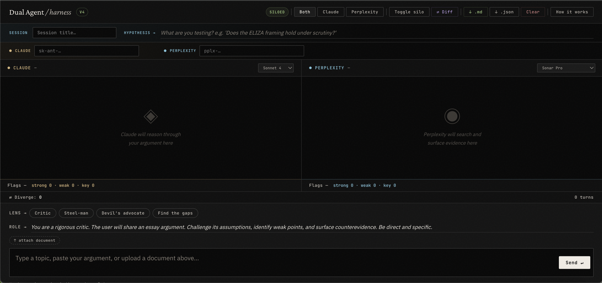

# Dual Agent Harness

A browser-based research tool for comparing Claude and Perplexity side by side. Send one prompt, get two independent responses, flag what matters, surface divergences, and export a structured session record.

Built for writers, researchers, and product thinkers who want to pressure-test an idea against independent AI reasoning before committing to it.

**No server. No install. Bring your own API keys.**



---

## What it does

You type a topic, paste an argument, or upload a document. Both agents respond in parallel. You choose the lens — critic, steel-man, devil's advocate, or find the gaps — and the role prompt shapes how they approach your input. Flag the responses, run a diff to surface genuine contradictions, and export everything as a clean markdown file or structured JSON.

---

## Features

| | |
|---|---|
| **Two panels, one input** | Claude and Perplexity respond in parallel to every message |
| **Model selector** | Choose per panel — Claude: Haiku 4.5, Sonnet 4, Opus 4 · Perplexity: Sonar, Sonar Pro, Sonar Reasoning Pro, Sonar Deep Research |
| **Siloed mode** | Each agent has its own independent conversation history — no cross-contamination between panels |
| **Lens chips** | Multi-select modifiers: Critic, Steel-man, Devil's advocate, Find the gaps — each appends a specific instruction to the role prompt |
| **Role prompt** | Always-visible, always-editable instruction that defines how both agents approach your input |
| **Document upload** | Attach a `.txt`, `.md`, or `.pdf` — content is injected as context into both agent calls |
| **Per-response flagging** | Tag each response: `↑ strong`, `↓ weak`, `★ key`, `⇄ diverge` — tinted in each panel's color |
| **⇄ Diff** | Fires a third Claude call that compares the last response from each agent and surfaces genuine contradictions |
| **Per-panel score bars** | Live flag tally under each panel — Claude flags under Claude, Perplexity flags under Perplexity |
| **Session export** | Download as `.md` (readable, self-documenting, pasteable back into Claude) or `.json` (full structured data) |
| **Key persistence** | API keys save to localStorage — pre-filled every time you open the file |
| **Response metadata** | Model name, timestamp, and latency on every response |

---

## Getting started

### 1. Get your API keys

You need one key from each provider. Both bill separately from their Pro subscriptions on a pay-as-you-go basis.

- **Claude** → [console.anthropic.com](https://console.anthropic.com) → API Keys
- **Perplexity** → [perplexity.ai/api-platform](https://perplexity.ai/api-platform) → API Keys

A typical research session costs well under $0.10.

### 2. Open the tool

**Local:** Download `index.html` and open it in Chrome or Safari. No installation, no terminal, no server needed.

**Hosted:** If you're viewing this repo on GitHub Pages, open the live link directly in your browser.

### 3. Enter your keys

Paste your Claude and Perplexity API keys into the key bar. They save to your browser's localStorage automatically — you only need to do this once per browser.

> **Privacy:** Keys are stored locally in your browser and sent directly to Anthropic and Perplexity's APIs. They never touch any server associated with this tool.

### 4. Name your session and write your hypothesis

The session title becomes the export filename. The hypothesis field documents what you're testing — included in every export so your sessions are self-archiving.

### 5. Send

Type a topic, paste your argument, or upload a document. Pick a lens if you want one. Hit **Send ↵** or **⌘↵**.

---

## Workflow: argument stress-testing

1. **Name the session** — e.g. `eliza-framing-test`
2. **Write the hypothesis** — e.g. *"Does the ELIZA framing hold under scrutiny?"*
3. **Set the role** — the default critic prompt works well, or write your own
4. **Pick a lens** — try Steel-man to get the strongest version before the critique
5. **Paste your argument** — send to both agents in siloed mode for independent signals
6. **Flag responses** — mark strong counterarguments, weak ones, key insights, divergences
7. **Run ⇄ Diff** — surface where Claude and Perplexity actually contradict each other
8. **Export .md** — paste the session record back into your writing tool as evidence

---

## Keyboard shortcuts

| Shortcut | Action |
|---|---|
| `⌘↵` | Send message |
| `Escape` | Close help modal |

---

## Cost reference

| Provider | Model | Approx. cost |
|---|---|---|
| Anthropic | Claude Sonnet 4 | ~$3 / 1M input tokens · ~$15 / 1M output tokens |
| Anthropic | Claude Haiku 4.5 | Cheaper — good for quick tests |
| Anthropic | Claude Opus 4 | Most capable — higher cost |
| Perplexity | Sonar Pro | ~$3 / 1M tokens + $0.005 / search |
| Perplexity | Sonar | Cheaper — lighter retrieval |

---

## Tech

Single self-contained HTML file. No framework, no build step, no dependencies, no server.

- Vanilla HTML / CSS / JS
- Direct browser-to-API calls (`api.anthropic.com` and `api.perplexity.ai`)
- `localStorage` for key, model preference, and session persistence
- Google Fonts: JetBrains Mono · IBM Plex Sans · Crimson Pro

---

## Running locally

```bash
git clone https://github.com/yourusername/dual-agent-harness.git
cd dual-agent-harness

# Open directly — no server needed
open dual-agent-v4.html
```

---

## Deploying to GitHub Pages

1. Push this repo to GitHub
2. Go to **Settings → Pages**
3. Under **Source**, select **Deploy from a branch**
4. Set branch to `main`, folder to `/ (root)`
5. Save — your tool is live at `https://yourusername.github.io/dual-agent-harness`

> Rename `dual-agent-v4.html` to `index.html` before pushing so the Pages URL opens the tool directly without needing to specify a filename.

---

## GitHub repo settings

**About (description):**
> A browser-based dual-agent research harness. Compare Claude and Perplexity side by side, flag responses, run divergence analysis, and export structured session records. No server. Bring your own keys.

**Website:** Your GitHub Pages URL once deployed.

**Topics:** `ai` `llm` `research-tools` `claude` `perplexity` `productivity` `writing` `no-code`

**Uncheck:** Packages, Releases (not relevant for a single-file tool)

---

## In-tool help

Click **How it works** in the top-right corner of the tool for a full feature walkthrough.

---

## License

MIT — use it, fork it, build on it.
